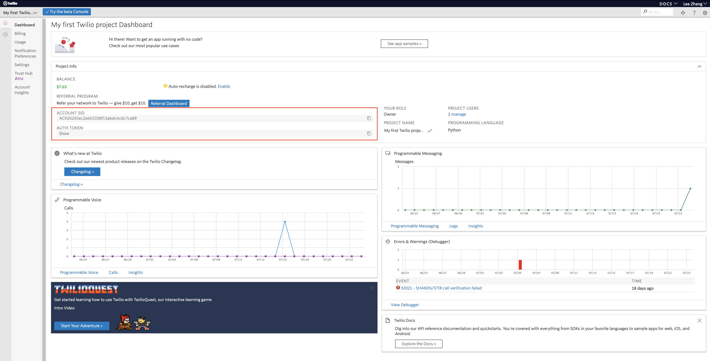
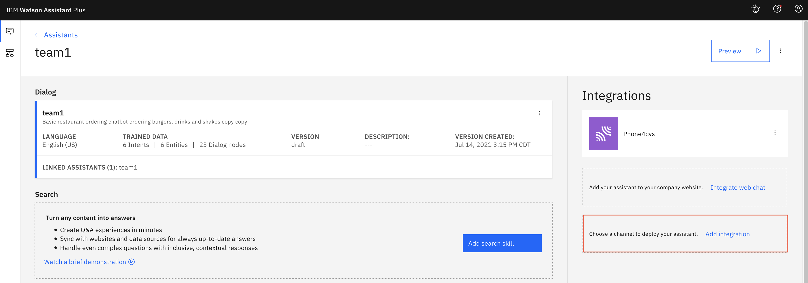
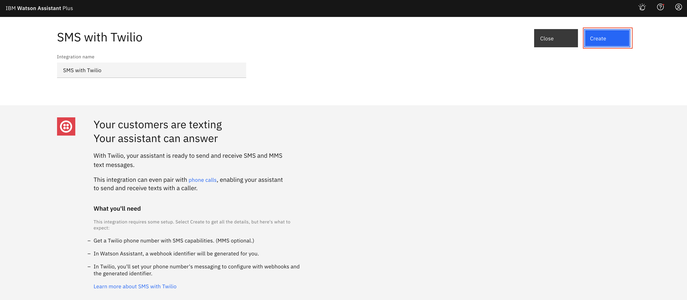
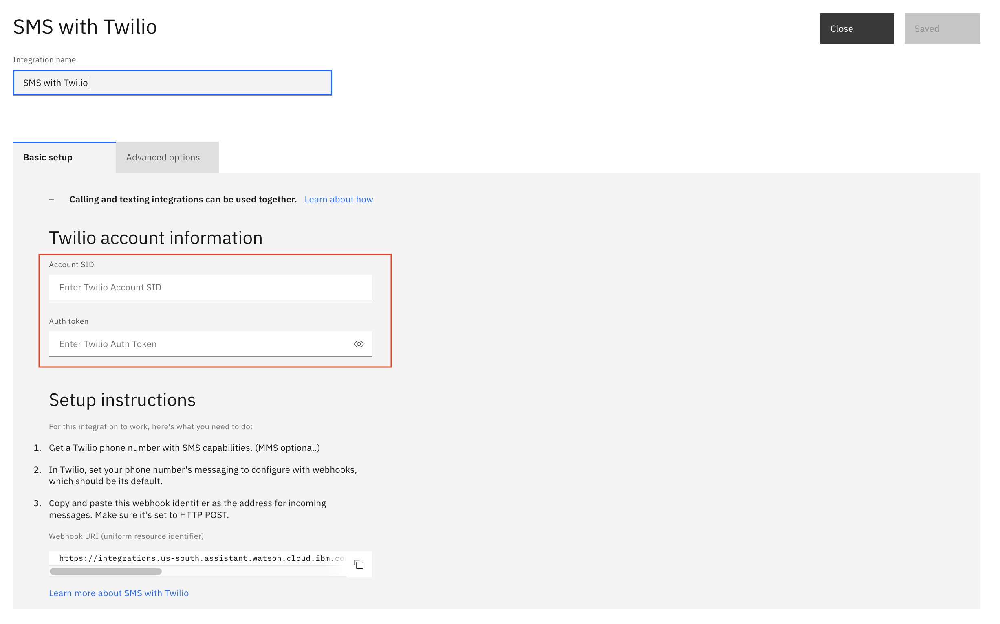
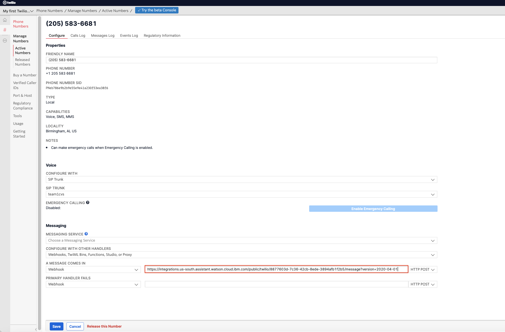
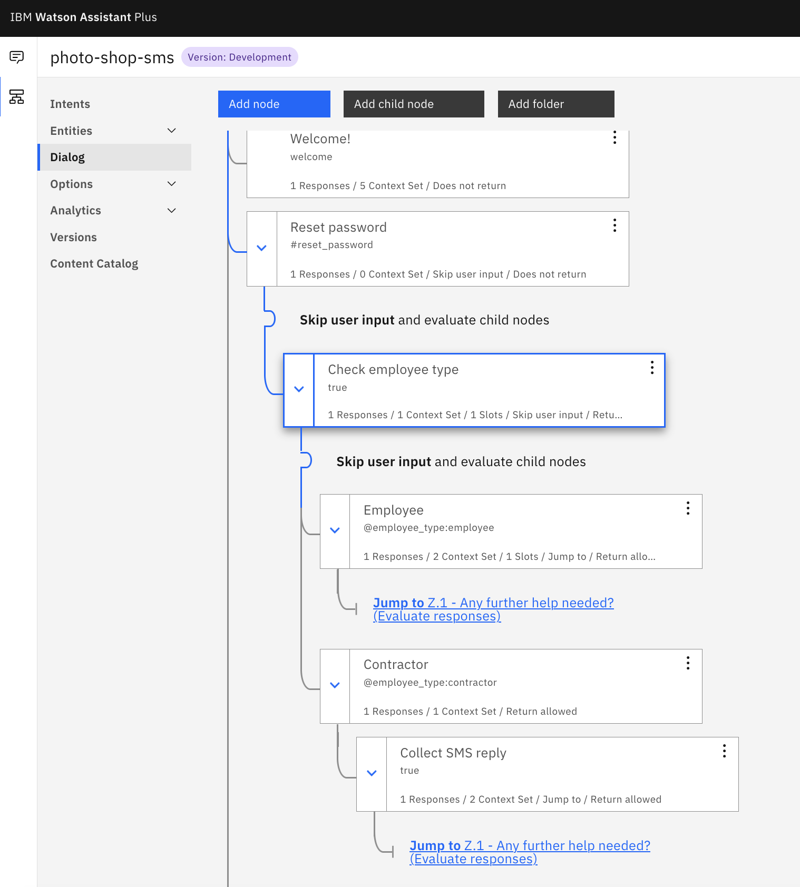
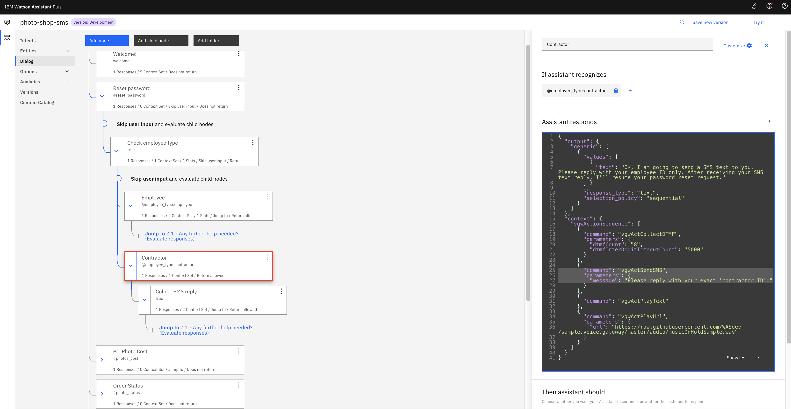
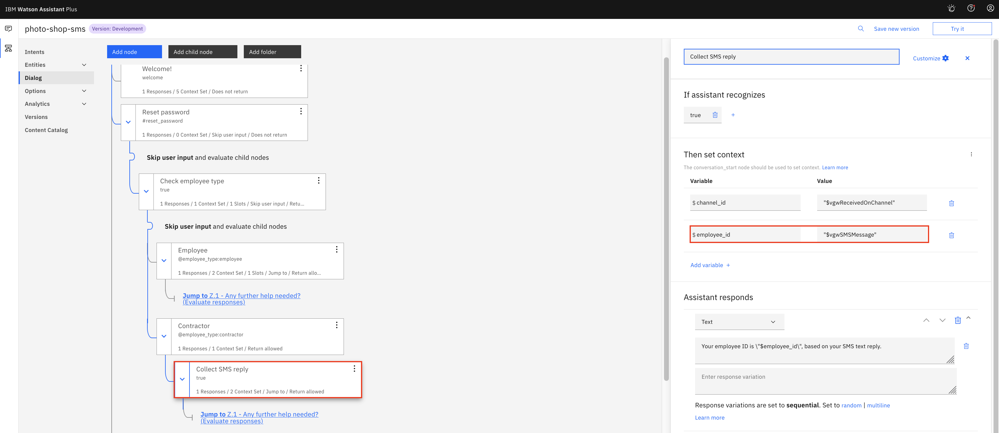

# Integrating Watson Assistant with SMS via Twilio

Combination of the Watson Assistant Phone integration and SMS text integration offers an easy solution for a tough industry problem. 

Watson Assistant Phone Integration provides a superior option over the traditional IVR system (Interactive Voice Response). It infuses AI into everyday customer support, helpdesk, HR enrollment process and etc.

A common issue with any voice system is how to accurately catch end user response, especially when the end user is prompted to provide a long alphanumeric string, such as shipping tracking number, employee ID and etc.

With the Watson Assistant Phone Integration, you may build a custom speech model and add Watson Assistant custom code to accomplish the task. ALternatively, you may choose to accurately collect the long alphanumeric end-user response by enabling SMS text integration. 

Combination of the Watson Assistant Phone integration and SMS text integration offers an easy solution for a tough industry problem. 


## Integration Overview of Watson Assistant with SMS via Twilio

Add a text messaging integration so your assistant can exchange messages with your customers.

The Short Messaging Service (SMS) supports text-only messages. Typically, SMS restricts the text message length to 160 characters. The Multimedia Messaging Service (MMS) supports sending images and text messages that are over 160 characters in length. When you create a phone number with Twilio, MMS message support is included automatically.

Customers send text messages to your Twilio-hosted phone number. Twilio uses a messaging webhook that you set up to send a POST request with the text message body to your assistant. Each response from the assistant is sent back to Twilio to be converted to an outbound SMS message that is sent to the customer. The responses are sent to the Twilio API for processing. You provide your Twilio account SID and project authentication token information, which serve as your Twilio API access credentials.

The integration currently does not support the following functions:
- Starting an SMS-only interaction with an outgoing text
- Configuring backup locations
- Reviewing the usage summary page. Use IBM Log Analysis instead. For more information, see Viewing logs.


## Use Case

Reset password use case is used to illustrate SMS text capability as well as other Watson Assistant features, for example, playing music when the chatbot is on-hold waiting for SMS text reply from end user, provide data entry over voice and phone keypad, and etc.

- End user calls helpdesk and asks for `password reset` help
- chatbot prompts if the end user is an `employee` or a `contractor`
- For regular employee, the end user is prompted for `employee ID`
  * the end user can choose to provide the `employee ID` over the voice,
  * or, choose to enter the `employee ID` via phone keypad 
- For a contractor, a SMS text message is sent to the end user to collect the `contractor ID`
  * while waiting for the SMS text reply from the end user, the chatbot plays music
  * upon the SMS text reply arrives, the chatbot collects the `contractor ID` and store it as a context variable
- the chatbot and the end user continue the phone converssation to complete the `password reset` request


## Pre-requisites

Both Watson Assistant Phone Integration and Watson Assistant SMS Integration are required to implement the use case in this repo.

Watson Assistant Phone Integration is required to have a phone solution with Watson Assistant chatbot. If you need instructons for Watson Assistant Phone Integration, you may refer to [IBM Phone Integration Solution with Watson Services & Twilio](https://github.com/lee-zhg/watson-voicebot).


## Steps

Complete the steps below to configure Watson Assistant MSM integration with Twilio.


### Step 1 - Retrieve Twilio Information

1. Login to your Twilio account at https://www.twilio.com. If you don't have an account yet, you may create a free trial account.

1. Click the home icon to go to your project dashboard.

    

1. Take note of the value of `Account SID` and `Auth token`. You will need both values for later.


### Step 2 - Configure Watson Assistant

To integrate Watson Assistant with SMS via Twilio,

1. Login to IBM Cloud.

1. Search and locate the Watson Assistant instance.

1. Open the instance.

1. Select `Launch Watson Assistant` button on the `Manage` tab.

1. On the `Assistants` tab of the Watson Assistant window, select your assistant tile.

1. From the Integrations section, click `Add integration`.

  

1. Click `SMS with Twilio`.

  

1. Click `Create`.

  

1. Eneter values in the field `Account SID` and `Auth token`. You should have retrieved the information in the previous section.

1. Scroll to the `Setup instructions` section, and take note of the value in the `Webhook URI (uniform resource identifier)` field. The information will be used to set the webhook configuration in Twilio. 

  > Note: If you want to support more than one phone number, you must add the URI to the webhook for each phone number separately.

1. Select `Save and exit` button. 


### Step 3 - Configure Twilio

1. Go to your Twilio account web page. 

1. Select `All Products & Services` in the most left pane to bring up the menu option.

1. Select the `Phone Numbers` option from the menu list.

1. Select the your Twilio phone# on the `Active Numbers` tab.

1. Scroll to the `Messaging section`, and then find the `Webhook` field. It defines what to do when a message comes in.

    

1. Enter the value from the previous section in the `Webhook` field.

  > Note: If you want to support multiple phone numbers, repeat the previous step for each phone number that you want to use.

1. Save.

If you want your assistant to be able to switch between voice and text during a customer interaction, configure both the phone and text messaging integrations. The integrations do not need to use the same third-party service provider. 


### Step 4 - Explore Dialog Skill

`data/skill-photo-shop-sms.json` provides a sample skill to illustrate the `password reset` use case in this repo. 

To reiterate the use case,
 
- End user calls helpdesk and asks for `password reset`
- chatbot prompts if the end user is an `employee` or a `contractor`
- For regular employee, the end user is prompted for `employee ID`
  * the end user can choose to provide the `employee ID` over the voice,
  * or, choose to enter the `employee ID` via phone keypad 
- For a contractor, a SMS text message is sent to the end user to collect the `contractor ID`
  * while waiting for the SMS text reply from the end user, the chatbot plays music
  * upon the SMS text reply arrives, the chatbot collects the `contractor ID` and store it as a context variable
- the chatbot and the end user continue the phone converssation to complete the `password reset` request

  


#### Step 4.1 - Watson Assistant Sends SMS Message

After Watson Assistant identies that the end user is a contractor, the Watson Assistant chatbot sends a SMS text message for collecting `Contractor ID` to the same phone# which is used to initiated phone call. 

Because telephone keypad only has digital keys, entering alphanumeric string via telephone keypad is not very intuitive. As the alternative, SMS text message and its reply can be very handy for collecting non-digital ifnormation.

  

1. On node `Contractor`, the Watson Assistant chatbot sends a SMS text message (`vgwActSendSMS`).

  ```
      "vgwActionSequence": [
        {
          "command": "vgwActCollectDTMF",
          "parameters": {
            "dtmfCount": "12",
            "dtmfInterDigitTimeoutCount": "5000"
          }
        },
        {
          "command": "vgwActSendSMS",
          "parameters": {
            "message": "Please reply with your exact 'contractor ID':"
          }
        },
        {
          "command": "vgwActPlayText"
        },

        ......
      ]
  ```

  > Note: SMS text message can be sent to different phone# if necessary.

2. After the SMS text message was sent, the Watson Assistant chatbot also plays a typical chatbot response (`vgwActPlayText`).

3. Before the SMS text message was sent, command `vgwActCollectDTMF` is called to also accept en-user input via telephone keypad for 12-chartacters long string.


#### Step 4.2 - Watson Assistant Collects SMS Text Reply

On the `Collect SMS reply` node, SMS reply context variable `$vgwSMSMessage` is stored in context variable `$employee_id`.

  


#### Step 4.3 - Watson Assistant Plays Music while On-hold

1. On node `Contractor`, After the Watson Assistant chatbot sends a SMS text message and plays its reply, it starts playing music while waiting for SMS reply. 

  ```
      {
        "command": "vgwActPlayUrl",
        "parameters": {
          "url": "https://raw.githubusercontent.com/WASdev/sample.voice.gateway/master/audio/musicOnHoldSample.wav"
        }
      }
  ```

#### Step 4.4 - Watson Assistant Accepts User Input via Voice or Telephone Keypad

On node `Employee`, command `vgwActCollectDTMF` is issued to accept six digit `Employee ID` in two ways
  - speaking employee ID over voice
  - enter employee ID via telephone keypad

```
{
  "output": {
    "generic": [
      {
        "values": [
          {
            "text": "Please enter you employee ID"
          }
        ],
        "response_type": "text",
        "selection_policy": "sequential"
      }
    ]
  },
  "context": {
    "vgwActionSequence": [
      {
        "command": "vgwActCollectDTMF",
        "parameters": {
          "dtmfCount": "6",
          "dtmfInterDigitTimeoutCount": "5000"
        }
      },
      {
        "command": "vgwActPlayText"
      }
    ]
  }
}
```


### Step 5 - Verification

You can run steps in this section for quick verification.

#### Step 5.1 - Reply Contractor ID via SMS Text Message

1. Call your Twilio phone# from your cell phone.

1. The chatbot replies with welcome greeting.

1. You say `reset password`.

1. The chatbot replies `Are you an employee or contractor?`

1. You say `contractor`.

1. The chatbot sends SMS text message to your cell phone: `Please reply with your exact 'contractor ID':`.

1. The chatbot reads the instruction: `OK, I am going to send a SMS text to you. Please reply with your employee ID only. After receiving your SMS text reply, I'll resume your password reset request.`

1. The chatbot plays music while waiting for contractor ID.

1. You reply SMS text message `abc123456def`.

1. The chatbot announces `Your employee ID is "abc123456def", based on your SMS text reply.`


#### Step 5.2 - Enter Employee ID via Telephone Keypad

1. Call your Twilio phone# from your cell phone.

1. The chatbot replies with welcome greeting.

1. You say `reset password`.

1. The chatbot replies `Are you an employee or contractor?`

1. You say `employee`.

1. The chatbot replies: `Please enter you employee ID`

1. You enter `123456` on the telephone keypad.

1. The chatbot announces `you entered employee ID 123456`.


#### Step 5.3 - Provide Employee ID over Voice

1. Call your Twilio phone# from your cell phone.

1. The chatbot replies with welcome greeting.

1. You say `reset password`.

1. The chatbot replies `Are you an employee or contractor?`

1. You say `employee`.

1. The chatbot replies: `Please enter you employee ID`

1. You say `123456` to the telephone.

1. The chatbot announces `you entered employee ID 123456`.


